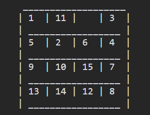
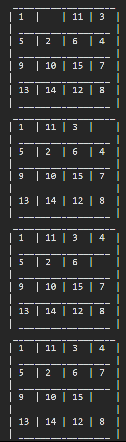
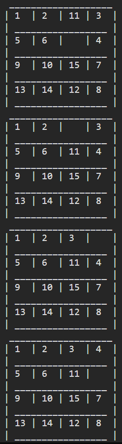
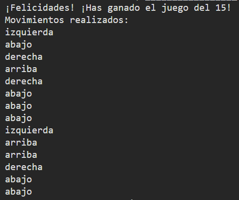

# TAKED (15-puzzle game)

## Summary
This code implements the A* algorithm to solve the 15-puzzle game by using Manhattan distances.

***Note: The code initializes a 4x4 board with numbers from 1 to 15 and a blank space represented as " ". It shuffles the board using random moves, then uses the A\* algorithm to find the optimal solution to the puzzle. The program prints the steps taken to solve the puzzle once the solution is found.***

- It calculates the total cost (f) for the **A* algorithm.** The cost includes the number of moves made so far and a heuristic estimate, which is the sum of Manhattan distances of numbers from their goal positions.
- The **A\* algorithm** is implemented here. It uses a priority queue to explore states efficiently.
- It iteratively explores states until it finds a winning state.
- The algorithm considers possible moves (up, down, left, right), generates new states, and evaluates them based on the total cost.

## How it works

1. The code initializes a 4x4 board with numbers from 1 to 15 and a blank space represented as " ".

    

2. Ones the initial board is made and printed, the program will generate and print the best way to solve the game **(shortest way)**, state by state.

    Note: Each unique representation of the board is considered a **state** depending on the position of the pieces.

    ***Example:***

    
    

3. Finally, it shows a list of the total movements to solve the game.

    

## Credits
Created by @Ninjadrian and @AyElAldo
